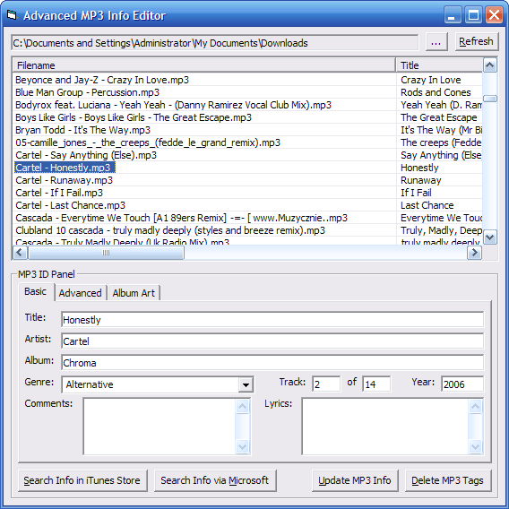



## ID3 Class \+ Advanced ID3 Tag Editor

### Description

It just keeps getting better. This bundle features my ID3 class that intially took me 1.8 days to make and perfect. This class allows analyzing and editing of ID3v1 tags, older and newer ID3v2 tags, AND older and newer Lyrics3 tags. I also included a program to manage your MP3s that took me nearly an entire day to make as an example of use of this class. From the list view, you can play a file by double clicking the item or by focusing on the list view and pressing enter. You can also customize the columns in the list view by repositioning them. From the MP3 ID panel, you can view the meta information and/or edit it. The basic view consists of the title, artist, album, genre, track number, year, comments, and lyrics. The more advanced view consists of original artist, original album, copyright, and more. In this view, you can even scroll through the text fields using the middle wheel of your mouse (if available), provided that the list view is not focused. Another feature included is the automatic retrieval of song data from the iTunes store and Microsoft for particular MP3 files. The application will automatically install the vbzlib.dll file required to decompress GZip-compressed iTunes store data if it doesn't detect the DLL file. Thanks to GDI+, you can also add and/or edit album art in MP3 files, and the application is also capable of updating the album art using the automatic retrieval of song data. The class works efficiently as tested, so feel free to use the class in your existing projects. Find more information about ID3 tags at http://id3.org.
 
### More Info
 

             |
---                |---
**Submitted On**   |2007-08-06 20:46:20
**By**             |[mathXpert](https://github.com/Planet-Source-Code/PSCIndex/blob/master/ByAuthor/mathxpert.md)
**Level**          |Advanced
**User Rating**    |4.9 (59 globes from 12 users)
**Compatibility**  |VB 6\.0
**Category**       |[Files/ File Controls/ Input/ Output](https://github.com/Planet-Source-Code/PSCIndex/blob/master/ByCategory/files-file-controls-input-output__1-3.md)
**World**          |[Visual Basic](https://github.com/Planet-Source-Code/PSCIndex/blob/master/ByWorld/visual-basic.md)
**Archive File**   |[ID3\_Class\_207876882007\.zip](https://github.com/Planet-Source-Code/mathxpert-id3-class-advanced-id3-tag-editor__1-67706/archive/master.zip)

